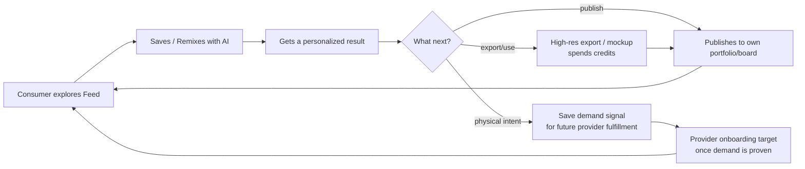

# Vision & Strategy

## Problem

- Inspiration platforms (Pinterest) are great at discovery but dead-end at a static image — you can't reliably adapt it into an ad, thumbnail, poster, merch graphic, or brand asset you can actually use.
- Creation tools (Canva, Midjourney) are great at generating but have no social/discovery layer and no path to a real, physical or professionally-crafted outcome.
- Marketplaces (Etsy, Amazon, Fiverr) sell existing catalog/listings, not "make this specific thing that looks like what I just imagined."
- Portfolio platforms (Behance, Dribbble, Instagram) showcase work but aren't wired into commerce.

Nobody owns the full loop: **see something you like → remix it into your format → export/use it digitally → showcase it → later get the physical version made.**

## Vision statement

> ProductDesignOS is a remix-first design platform that turns inspiration into personalized digital assets and real-world product concepts for individuals, creators, and brands.

## Strategic wedge (how we avoid boiling the ocean)

We will not attempt "Pinterest for everything" on day one. The feed may feel familiar and visual, but each item is not just a pin; it is an editable **Design** with category, format, prompt, remix controls, and export/mockup paths. We start with a small number of intent clusters where:

- Search/social demand is already large (people already look for this on Pinterest/Instagram/TikTok/Etsy/YouTube).
- The first useful output is digital: export, mockup, share, portfolio, or request intent — no physical fulfillment dependency on day one.
- AI generation quality with current open-weight models is already good for layouts, graphics, posters, ad concepts, thumbnails, apparel prints, and product mockups, so the "remix" moment feels magic on day one.

See [02-audience-niches.md](02-audience-niches.md) for the launch clusters and selection criteria. The platform architecture is category-agnostic (a pluggable "category + format" model, see docs 04 and 06) so adding new design types later is configuration, not re-architecture.

## Competitive framing

| Platform | Discover | Create/Remix (AI) | Showcase/Portfolio | Transact/Marketplace |
|---|---|---|---|---|
| Pinterest | Strong | None | Weak | None |
| Canva / Midjourney | Weak | Strong | Weak | None |
| Behance / Dribbble / Instagram | Medium | None | Strong | Weak |
| Etsy / Amazon | Weak | None | Weak | Strong |
| Houzz | Medium | None | Medium | Medium (leads) |
| **ProductDesignOS** | **Strong** | **Strong** | **Strong** | **Strong** |

Our defensibility isn't any single quadrant — it's owning the connective tissue between all four, so a pin isn't a dead end.

## The core flywheel

More consumers → more remix activity → more published designs and export intent → clearer demand signals by category/format → better creator/provider onboarding targets → richer feed and, later, better fulfillment. Both sides of the flywheel are fed by the same "Design" object (a design is simultaneously inspiration, an AI-remixable asset, a portfolio piece, an exportable digital asset, and a potential physical-product request).

## What we are NOT doing in v1

- Not building our own manufacturing/print/shipping infrastructure in v1 — physical products start as remixable mockups and saved demand signals; POD/dropship/provider fulfillment comes after demand is visible.
- Not supporting arbitrary user-defined categories from day one — start curated around common digital and physical-product design formats, then open up UGC categories once moderation tooling exists.
- Not processing provider payouts in the MVP (see [08-credits-and-monetization.md](08-credits-and-monetization.md)); paid credits can be tested earlier through exports/mockups if we choose.
