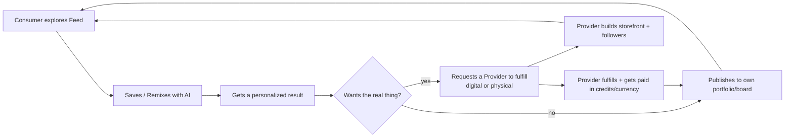

# Vision & Strategy

## Problem

- Inspiration platforms (Pinterest) are great at discovery but dead-end at a static image — you can't act on it.
- Creation tools (Canva, Midjourney) are great at generating but have no social/discovery layer and no path to a real, physical or professionally-crafted outcome.
- Marketplaces (Etsy, Amazon, Fiverr) sell existing catalog/listings, not "make this specific thing that looks like what I just imagined."
- Portfolio platforms (Behance, Dribbble, Instagram) showcase work but aren't wired into commerce.

Nobody owns the full loop: **see something you like → make it yours with AI → show it off → get the real thing made or bought.**

## Vision statement

> ProductDesignOS is the platform that understands *you* — your taste, your work, your business — and turns inspiration into a personalized outcome, digital or physical, faster than anywhere else.

## Strategic wedge (how we avoid boiling the ocean)

We will not attempt "Pinterest for everything" on day one. We pick a small number of verticals where:

- Search/social demand is already large (people already look for this on Pinterest/Instagram/TikTok/Etsy).
- Fulfillment is feasible for a tiny team (digital delivery, print-on-demand/dropship, or a small curated local-provider pool — not our own logistics/inventory).
- AI generation quality with current open-weight models is already good (images, logos, patterns, mockups) so the "remix" moment feels magic on day one.

See [02-audience-niches.md](02-audience-niches.md) for the shortlist and selection criteria. The platform architecture is vertical-agnostic (a pluggable "category" model, see docs 04 and 06) so adding new verticals later is configuration, not re-architecture.

## Competitive framing

| Platform | Discover | Create/Remix (AI) | Showcase/Portfolio | Transact/Marketplace |
|---|---|---|---|---|
| Pinterest | Strong | None | Weak | None |
| Canva / Midjourney | Weak | Strong | Weak | None |
| Behance / Dribbble / Instagram | Medium | None | Strong | Weak |
| Etsy / Amazon | Weak | None | Weak | Strong |
| Houzz | Medium | None | Medium | Medium (leads) |
| **ProductDesignOS** | **Strong** | **Strong** | **Strong** | **Strong** |

Our defensibility isn't any single quadrant — it's owning the connective tissue between all four, so a pin isn't a dead end.

## The core flywheel

More consumers → more remix activity → more demand signal for providers → more providers join → richer feed and better fulfillment → more consumers. Both sides of the flywheel are fed by the same "Design" object (a pin is simultaneously inspiration, an AI-remixable asset, and a potential order).

## What we are NOT doing in v1

- Not building our own manufacturing/print/shipping infrastructure — we integrate with POD/dropship partners and let local providers handle their own fulfillment.
- Not supporting arbitrary user-defined categories from day one — start curated, open up UGC categories once moderation tooling exists.
- Not processing real payments in the MVP (see [08-credits-and-monetization.md](08-credits-and-monetization.md)).
