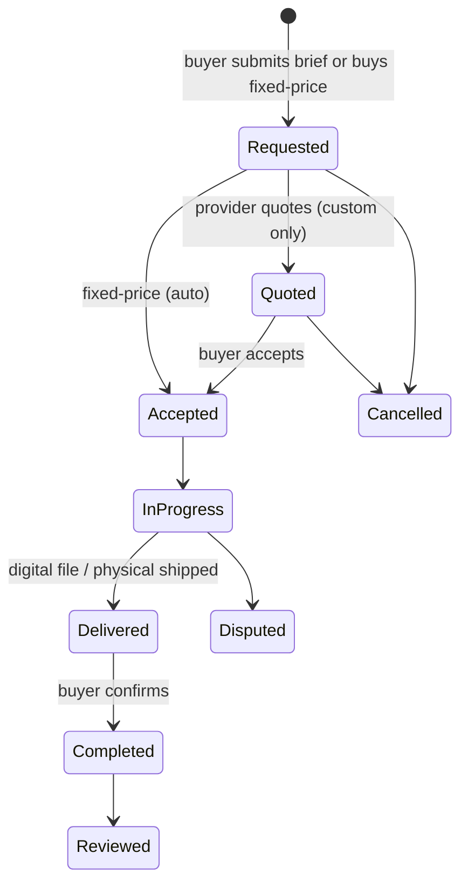

# Roles & Marketplace Model

The brainstorm explicitly called for something **scalable where we can just assign roles and extend features accordingly** — this doc is the answer.

## Principle: roles, not account types

There is one `User` (person) and optionally one `Organization` (agency/business/team). Capabilities come from **Roles** assigned to a user (globally or within an org), not from a fixed "account type" chosen at signup. A single user can simultaneously be an Explorer, a Creator, and a Provider.

```
User
 ├─ has many → UserRole (role, scope, grantedAt, status)
 ├─ may belong to → OrganizationMembership (org, orgRole)
 └─ has one → TrustProfile (verification tier, score, badges)
```

### Base roles (v1)

| Role | Grants |
|---|---|
| `explorer` (default, implicit) | Browse, save, follow, remix (spends credits), request custom orders |
| `creator` | Public profile/portfolio, publish designs, list **digital** Offerings, receive follows |
| `provider` | Everything `creator` has, plus list **physical**/**service** Offerings, receive quote requests, appear in category-based provider search |
| `org_owner` / `org_manager` / `org_member` | Scoped to an `Organization`; manage seats, shared credit pool, shared storefront |
| `moderator` | Review queue, content actions, provider verification decisions |
| `admin` | Full platform config, feature flags, category schema management |

### Why this scales without redesign

- New roles (`affiliate`, `brand_partner`, `verified_expert`, ...) are just new rows in a `roles` table + a permission set — no schema migration for new "account types."
- Features are gated by **capability checks** (`can(user, 'offering.create.physical')`), not by `if (user.type === 'provider')` branching — so adding a role only means defining its capability set.
- Org accounts reuse the same role system at a different scope (org-scoped roles), so agencies don't need a separate code path.

## Trust tiers (progressive unlock, not a one-time approval gate)

| Tier | How reached | Unlocks |
|---|---|---|
| 0 — New | Signup | Browse, remix (limited daily credits), publish private/followers-only |
| 1 — Creator | Email/phone verified, profile completed | Public portfolio, publish digital Offerings up to a value cap |
| 2 — Verified Provider | ID/business verification, sample portfolio reviewed | Physical/service Offerings, appear in provider search & quote requests |
| 3 — Trusted | N completed orders + review score threshold | Higher order value caps, featured placement, lower platform fee (future) |

This lets us onboard broadly and fast while keeping physical-goods risk gated behind verification — without needing separate signup funnels per segment.

## The universal marketplace entity: `Offering`

Instead of separate models per vertical, every sellable thing is an `Offering` with a `fulfillmentType` and a vertical-specific attribute payload validated against a JSON Schema registered per `Category` (see doc 06). This is what lets us add a new vertical (e.g., "furniture") as configuration, not code.

```
Offering
  id, ownerId (user or org), categoryId, title, description
  fulfillmentType: 'digital' | 'physical' | 'service'
  pricingType: 'fixed' | 'quote_only' | 'both'
  price?, currency/credits, leadTimeDays?
  attributes: JSON (validated against Category.attributeSchema)
  fulfillmentConfig: { podProvider?: 'printful'|'printify', shipsFrom?, regions? } (physical)
  status: draft | active | paused
```

## Order/transaction flow (shape shared by all verticals)



Payment step is intentionally abstracted (see doc 08): in MVP, "payment" = credit debit; the same state machine will call a payments adapter (Stripe Connect) later with no flow redesign.

## Extending to new segments later

Adding "affiliate marketing partners" or "enterprise brand accounts" later means: (1) add a role + capability set, (2) optionally add an `Organization` type flag if it needs org-level billing, (3) reuse `Offering`/`Order` unchanged. No new core tables expected.
