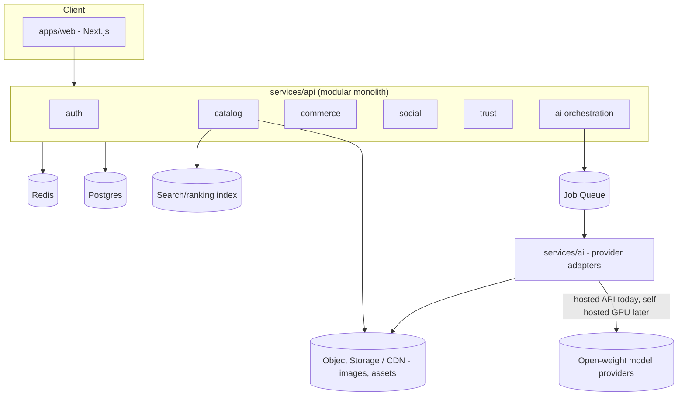
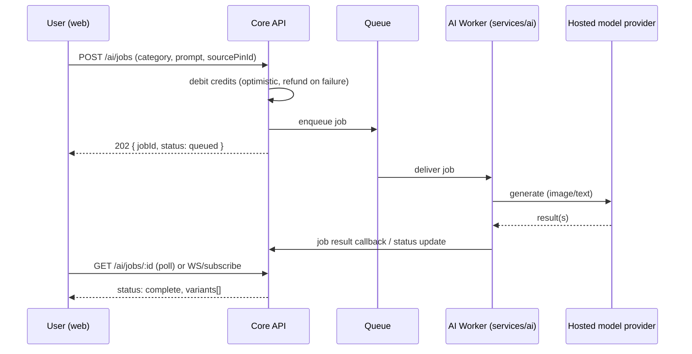

# Architecture

## Guiding call: modular monolith first

With a 2-5 person team and a 2-3 month runway to pilot, microservices-from-day-one is the wrong trade. We keep the existing 3-service seam (`apps/web`, `services/api`, `services/ai`) but organize `services/api` as a **modular monolith** with hard internal module boundaries so we can extract a service later without a rewrite.

```
services/api/src/modules/
  auth/          -- identity, sessions, roles/capabilities
  catalog/       -- designs/pins, boards, categories, tags
  ai/            -- job orchestration, calls services/ai adapters
  commerce/      -- offerings, orders, quotes, credit ledger
  social/        -- follows, comments, notifications
  trust/         -- verification, moderation, reviews
```

Each module owns its own tables and exposes an internal interface; no module reaches into another's tables directly. This is the extraction seam for later microservices (commerce and ai are the most likely first extractions once volume grows).

## High-level system diagram



## AI remix request flow (async job pattern — already partly present in the repo's `POST /api/ai/logo` + `GET /api/ai/job/:id`)



## Key infra decisions for the pilot

- **Database:** Postgres (managed, e.g., Neon/Supabase/RDS) replacing the current in-memory MVP stores — needed as soon as we have real users/credits/orders that must persist.
- **Object storage/CDN:** S3-compatible (Cloudflare R2 or S3 + CloudFront) for generated images/uploads; keep the current home-server Docker Compose for the app tier during pilot, but move stateful data (DB, storage) off a single home server before real users' data is at stake.
- **Queue:** lightweight (BullMQ on Redis, or Postgres-based queue like `pgboss`) for async AI jobs — avoids adding a heavy broker at MVP scale.
- **Search/feed ranking v1:** Postgres full-text + simple scoring query is enough; introduce a dedicated search/ranking service only once catalog size or personalization needs exceed what SQL can do well.
- **Auth:** keep JWT-based auth (already in `services/api`), add role/capability claims to the token or a fast capability-lookup cache.

## Why not microservices yet

- Team size (2-5) can't operationally support N deployable services, N CI pipelines, cross-service tracing, etc.
- The modular monolith gives 90% of the benefit (clear ownership, testability, independent evolution) with 10% of the operational cost.
- Extraction candidates when volume justifies it: `ai` module (different scaling profile — GPU-bound, bursty) and `commerce` module (different compliance/audit needs once real payments land).
