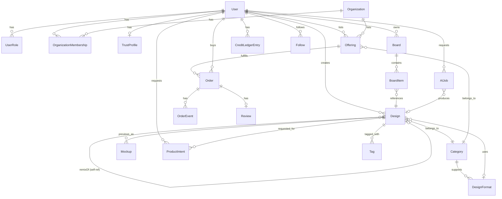

# Data Model

## Entity overview

## Core entities

- **User** — identity, auth, profile fields (display name, bio, avatar), default visibility settings.
- **UserRole** — `(userId, role, scope?, status)`; scope allows org-scoped roles.
- **Organization** — agencies/businesses; owns its own credit pool and Offerings; members via `OrganizationMembership(orgId, userId, orgRole)`.
- **TrustProfile** — `(userId, tier, verificationStatus, score, badges[])`.
- **Category** — the domain plug point: `(id, slug, name, intentCluster, attributeSchema: JSONSchema, aiPromptTemplate, allowedFulfillmentTypes[])`. Examples: ads, banners, thumbnails, posters, wall-art, apparel-graphics, gifts, logos.
- **DesignFormat** — the canvas/output plug point: `(id, categoryId, slug, name, aspectRatio?, dimensions?, outputProfile, mockupSlots?)`. Examples: YouTube thumbnail, Instagram square ad, LinkedIn banner, A4 poster, hoodie back print, cap front patch, mug wrap.
- **Design** ("Pin") — the unit of content: `(id, ownerId, categoryId, formatId?, sourceType: 'upload'|'ai_generated'|'remix', remixOfDesignId?, assetUrl, prompt?, visibility: public|followers|private, tags[], attributes)`. This single entity is simultaneously feed content, an AI remix result, a digital export candidate, a mockup source, and (optionally later) linked to an `Offering` as its reference image.
- **Board** — user collections; `BoardItem` links `Board` ↔ `Design`.
- **AIJob** — `(id, userId, categoryId, type: text2image|img2img|upscale|edit, sourceDesignId?, prompt, status, creditsCost, provider, resultDesignIds[])` — matches the existing job/polling pattern in `services/api`.
- **Mockup** — `(id, designId, formatId, productType?, assetUrl, status)` for previewing a design on a poster, wall, T-shirt, hoodie, cap, mug, gift, etc. before provider fulfillment exists.
- **ProductIntent** — `(id, userId, designId, productType, geography?, notes?, status)` captures "I want this made" demand without requiring an active provider.
- **Offering** — see doc 04 for full shape; the sellable unit (digital/physical/service), enabled after creator/provider supply exists.
- **Order** — buyer, offering, `OrderEvent` log for the state machine in doc 04, links to a `Review` on completion.
- **CreditLedgerEntry** — `(id, userId, delta, balanceAfter, reason: 'signup_bonus'|'referral'|'ai_generation'|'purchase'|'refund'|'admin_grant', refType, refId, createdAt)` — append-only, so balance is always derivable/auditable, and easy to reconcile when swapped for real currency.
- **Follow** — `(followerId, followedId)` for both individual users and organizations.
- **Review** — `(orderId, rating, text, photos[], response?)`.

## Why `Design` is the single most important table

Every strategic goal (inspiration feed, AI remix, portfolio, export, product mockup, and later provider fulfillment) reads/writes the same `Design` row from a different angle. Avoiding separate "Pin" vs "AIResult" vs "PortfolioItem" tables keeps ranking, moderation, and remix-lineage tracking (`remixOfDesignId` chains) simple and is what makes the flywheel in doc 01 implementable without duplicated content pipelines.

## Category and format extensibility mechanism

`Category.attributeSchema` and `DesignFormat` are validated at the API layer whenever a `Design.attributes` or `Offering.attributes` payload is written. The AI prompt template per category and output rules per format let the same `AIJob` pipeline produce appropriate prompts and canvases (e.g., YouTube thumbnail vs. Instagram ad vs. hoodie back print vs. wall poster) without branching application code — new design types are added by admin/config change, not a deploy.
