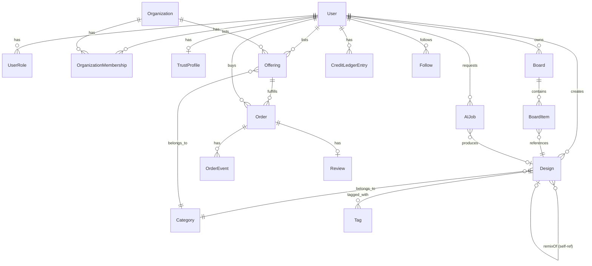

# Data Model

## Entity overview

## Core entities

- **User** — identity, auth, profile fields (display name, bio, avatar), default visibility settings.
- **UserRole** — `(userId, role, scope?, status)`; scope allows org-scoped roles.
- **Organization** — agencies/businesses; owns its own credit pool and Offerings; members via `OrganizationMembership(orgId, userId, orgRole)`.
- **TrustProfile** — `(userId, tier, verificationStatus, score, badges[])`.
- **Category** — the vertical-agnostic plug point: `(id, slug, name, attributeSchema: JSONSchema, aiPromptTemplate, allowedFulfillmentTypes[])`. Adding "furniture" or "tattoo" as a new vertical = inserting a row here, not shipping new code.
- **Design** ("Pin") — the unit of content: `(id, ownerId, categoryId, sourceType: 'upload'|'ai_generated'|'remix', remixOfDesignId?, assetUrl, prompt?, visibility: public|followers|private, tags[])`. This single entity is simultaneously feed content, an AI remix result, and (optionally) linked to an `Offering` as its reference image.
- **Board** — user collections; `BoardItem` links `Board` ↔ `Design`.
- **AIJob** — `(id, userId, categoryId, type: text2image|img2img|upscale|edit, sourceDesignId?, prompt, status, creditsCost, provider, resultDesignIds[])` — matches the existing job/polling pattern in `services/api`.
- **Offering** — see doc 04 for full shape; the sellable unit (digital/physical/service).
- **Order** — buyer, offering, `OrderEvent` log for the state machine in doc 04, links to a `Review` on completion.
- **CreditLedgerEntry** — `(id, userId, delta, balanceAfter, reason: 'signup_bonus'|'referral'|'ai_generation'|'purchase'|'refund'|'admin_grant', refType, refId, createdAt)` — append-only, so balance is always derivable/auditable, and easy to reconcile when swapped for real currency.
- **Follow** — `(followerId, followedId)` for both individual users and organizations.
- **Review** — `(orderId, rating, text, photos[], response?)`.

## Why `Design` is the single most important table

Every strategic goal (Pinterest-like feed, AI remix, portfolio, "make it real" marketplace CTA) reads/writes the same `Design` row from a different angle. Avoiding separate "Pin" vs "AIResult" vs "PortfolioItem" tables keeps ranking, moderation, and remix-lineage tracking (`remixOfDesignId` chains) simple and is what makes the flywheel in doc 01 implementable without duplicated content pipelines.

## Vertical extensibility mechanism

`Category.attributeSchema` (a JSON Schema) is validated at the API layer whenever a `Design.attributes` or `Offering.attributes` payload is written. The AI prompt template per category (`Category.aiPromptTemplate`) lets the same `AIJob` pipeline produce category-appropriate prompts (e.g., logo vs. apparel print vs. invitation copy) without branching application code — new verticals are added by an admin/config change, not a deploy.
